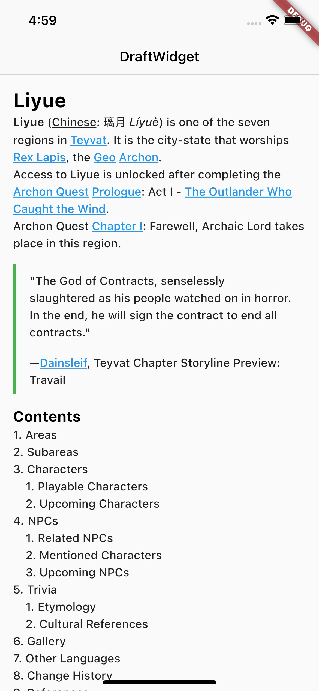
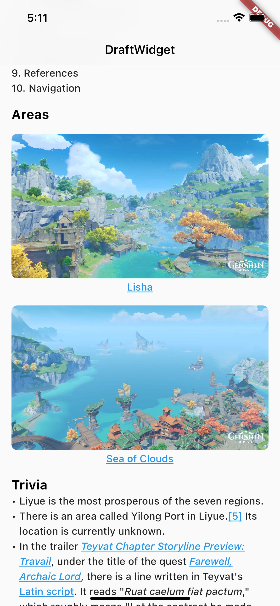
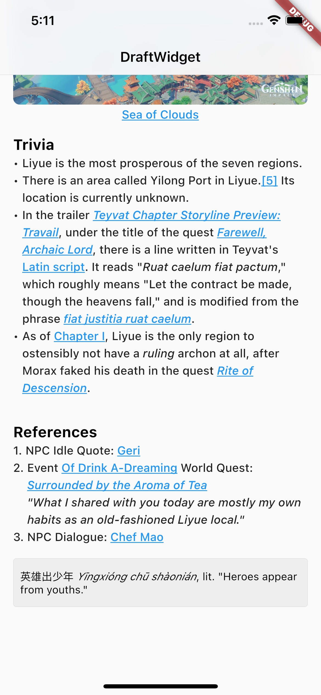

# Draft Widget

A Draft JS renderer written in Dart!

This project supports rendering Draft JS object in Flutter natively! It will convert draft js object into Flutter InlineSpan!

## Supported Styles

- Text with inline styles, links and alignment
- Headers
- Ordered list and unordered list with indent
- Images
- Blockquotes
- Code blocks
- Custom image, code block and blockquote widgets

## Screenshots

|                            |                            |
|----------------------------|----------------------------|
|  |  |
|  |                            |
